# Arquitectura Robusta de Facturación y Ventas

## 🎯 Objetivo
Recrear el flujo de facturación con una arquitectura clara, robusta y escalable donde:
- **Ventas** representan las transacciones comerciales (qué se vendió, a quién, cuánto)
- **Facturas** son los comprobantes oficiales de esas ventas
- Separación clara de responsabilidades
- Trazabilidad completa

---

## 📊 Modelo de Datos Propuesto

### 1. VENTA (Colección: `ventas`)
Representa la transacción comercial individual de un producto/lote.

```typescript
interface Venta {
  id: string;
  
  // Relación con factura (una venta pertenece a una factura)
  facturaId: string;          // ID de la factura que contiene esta venta
  
  // Información del producto vendido
  productoId: string;         // ID del producto vendido
  productoNombre: string;      // Nombre del producto
  producto Tipo: TipoProducto; // Tipo: LOTE_COMPLETO, UNIDADES_*, HUEVOS
  
  // Información del lote (si aplica)
  loteId?: string;            // ID del lote vendido
  tipoAve?: TipoAve;          // Tipo de ave (si aplica)
  
  // Detalles de la venta
  cantidad: number;           // Cantidad vendida
  precioUnitario: number;     // Precio por unidad al momento de la venta
  descuentoAplicado: number;  // Descuento aplicado a esta venta
  subtotal: number;          // cantidad × precioUnitario
  impuestos: number;         // Impuestos aplicados
  total: number;             // subtotal - descuento + impuestos
  
  // Información del cliente
  clienteId: string;
  clienteNombre: string;
  
  // Metadatos
  fecha: Date;               // Fecha de la venta
  metodoPago: MetodoPago;    // Método de pago
  estado: EstadoVenta;       // PENDIENTE, CONFIRMADA, CANCELADA
  observaciones?: string;
  
  // Auditoría
  createdBy: string;
  createdAt: Date;
  updatedAt: Date;
}

enum EstadoVenta {
  PENDIENTE = 'PENDIENTE',    // Venta registrada pero factura no generada
  CONFIRMADA = 'CONFIRMADA',   // Venta confirmada con factura
  CANCELADA = 'CANCELADA',    // Venta cancelada
}
```

### 2. FACTURA (Colección: `facturas`)
Representa el comprobante fiscal que agrupa una o más ventas.

```typescript
interface Factura {
  id: string;
  numero: string;            // Número único de factura (ej: FAC-001, FAC-002)
  
  // Información fiscal
  fechaEmision: Date;        // Fecha de emisión de la factura
  fechaVencimiento?: Date;   // Fecha de vencimiento si es crédito
  
  // Cliente
  cliente: Cliente;
  
  // Ventas incluidas en esta factura
  ventasIds: string[];       // IDs de las ventas que contiene esta factura
  
  // Resumen de montos
  subtotal: number;          // Suma de subtotales de ventas
  descuentoTotal: number;   // Suma de descuentos aplicados
  impuestosTotal: number;   // Suma de impuestos
  total: number;            // Total a pagar
  
  // Información adicional
  metodoPago: MetodoPago;
  observaciones?: string;
  
  // Estados
  estado: EstadoFactura;     // BORRADOR, EMITIDA, PAGADA, CANCELADA
  
  // Información para reimpresión
  numeroSerie?: string;      // Número de serie fiscal (si aplica)
  autorizacionHacienda?: string; // Autorización de hacienda (si aplica)
  
  // Auditoría
  createdBy: string;
  createdAt: Date;
  updatedAt: Date;
  fechaPagada?: Date;        // Fecha en que se marcó como pagada
}

enum EstadoFactura {
  BORRADOR = 'BORRADOR',     // En proceso de creación
  EMITIDA = 'EMITIDA',       // Emitida pero no pagada
  PAGADA = 'PAGADA',         // Pagada completamente
  CANCELADA = 'CANCELADA',   // Cancelada/anulada
}
```

### 3. VENTA TEMPORAL (Colección: `ventas_temporales`)
Para manejar el proceso de creación de factura.

```typescript
interface VentaTemporal {
  id: string;
  productoId: string;
  cantidad: number;
  clienteId: string;
  metodoPago: MetodoPago;
  observaciones?: string;
  fechaCreacion: Date;
  expiraEn: Date;           // Expiración automática después de X horas
}
```

---

## 🔄 Flujo de Trabajo Propuesto

### Flujo 1: Crear Venta Individual (sin factura)

```mermaid
graph TD
    A[Usuario selecciona producto] --> B[Crear Venta Temporal]
    B --> C[Validar inventario]
    C --> D{Stock suficiente?}
    D -->|No| E[Mostrar error]
    D -->|Sí| F[Guardar venta temporal]
    F --> G[Mostrar resumen de venta]
```


### Flujo 2: Generar Factura desde Ventas Temporales

```mermaid
graph TD
    A[Usuario selecciona ventas temporales] --> B[Validar todas las ventas]
    B --> C{Crean factura?}
    C -->|Sí| D[Iniciar transacción]
    D --> E[Crear documento factura]
    E --> F[Convertir ventas temporales en ventas confirmadas]
    F --> G[Actualizar estado facturaId en ventas]
    G --> H[Actualizar inventario]
    H --> I[Calcular totales]
    I --> J[Confirmar transacción]
    J --> K[Eliminar ventas temporales]
    K --> L[Mostrar factura generada]
```


### Flujo 3: Ventas Directas con Factura Inmediata

```mermaid
graph TD
    A[Usuario selecciona productos] --> B[Crear factura con ventas]
    B --> C[Transacción atómica]
    C --> D[Crear factura]
    D --> E[Crear ventas]
    E --> F[Actualizar inventario]
    F --> G[Calcular totales]
    G --> H[Confirmar]
    H --> I[Retornar factura]
```


---

## 🏗️ Arquitectura de Servicios

### 1. VentasService
**Responsabilidad**: Gestionar las ventas individuales

```typescript
class VentasService {
  // Crear venta temporal
  async crearVentaTemporal(datos: CrearVentaTemporal): Promise<VentaTemporal>
  
  // Confirmar venta temporal (convertir en venta real)
  async confirmarVentaTemporal(ventaTempId: string, facturaId: string): Promise<Venta>
  
  // Crear venta directa
  async crearVenta(datos: CrearVenta): Promise<Venta>
  
  // Obtener ventas de una factura
  async getVentasPorFactura(facturaId: string): Promise<Venta[]>
  
  // Obtener ventas de un lote
  async getVentasPorLote(loteId: string, tipoAve: TipoAve): Promise<Venta[]>
  
  // Cancelar venta
  async cancelarVenta(ventaId: string, razon: string): Promise<void>
  
  // Obtener estadísticas de ventas
  async getEstadisticasVentas(periodo: Periodo): Promise<EstadisticasVentas>
}
```

### 2. FacturasService
**Responsabilidad**: Gestionar las facturas (comprobantes)

```typescript
class FacturasService {
  // Crear factura desde ventas temporales
  async crearFacturaDesdeVentasTemporales(
    ventasTempIds: string[],
    clienteId: string,
    metodoPago: MetodoPago
  ): Promise<Factura>
  
  // Crear factura con ventas directas
  async crearFacturaConVentas(
    ventas: CrearVenta[],
    clienteId: string,
    metodoPago: MetodoPago
  ): Promise<Factura>
  
  // Emitir factura
  async emitirFactura(facturaId: string): Promise<Factura>
  
  // Marcar factura como pagada
  async marcarFacturaComoPagada(facturaId: string, fechaPago: Date): Promise<Factura>
  
  // Cancelar factura
  async cancelarFactura(facturaId: string, razon: string): Promise<Factura>
  
  // Obtener factura con sus ventas
  async getFacturaCompleta(facturaId: string): Promise<FacturaCompleta>
  
  // Obtener facturas por período
  async getFacturasPorPeriodo(periodo: Periodo): Promise<Factura[]>
  
  // Generar número de factura
  async generarNumeroFactura(): Promise<string>
}
```

### 3. VentasFacturacionOrquestator
**Responsabilidad**: Orquestar ventas y facturas en transacciones atómicas

```typescript
class VentasFacturacionOrquestator {
  // Crear venta con factura inmediata
  async venderYFacturar(datos: VenderYFacturarDatos): Promise<FacturaCompleta>
  
  // Crear múltiples ventas con una factura
  async venderMultiplesYFacturar(datos: VentasMultiplesDatos): Promise<FacturaCompleta>
  
  // Validar y crear factura desde ventas temporales
  async procesarFacturaDesdeVentasTemporales(
    ventasTempIds: string[]
  ): Promise<FacturaCompleta>
}
```

---

## 📝 Ventajas de esta Arquitectura

### 1. Separación de Responsabilidades
- **Ventas**: Transacciones comerciales, movimientos de inventario
- **Facturas**: Comprobantes fiscales, pagos, estados contables

### 2. Flexibilidad
- Puedes crear ventas sin factura (modo "borrador")
- Puedes agrupar múltiples ventas en una factura
- Puedes crear una factura directa de una venta

### 3. Trazabilidad Completa
- Cada venta tiene un registro individual
- Cada factura tiene referencia a sus ventas
- Se puede rastrear qué lotes se vendieron y cuándo

### 4. Escalabilidad
- Fácil agregar nuevos tipos de productos
- Fácil agregar descuentos o promociones
- Fácil integrar con sistemas contables externos

### 5. Robustez
- Transacciones atómicas garantizan consistencia
- Validaciones en cada capa
- Manejo de errores granular

---

## 🔧 Plan de Implementación

### Fase 1: Modelos de Datos (Prioridad: ALTA)
- [ ] Actualizar tipos en `src/types/facturacion.ts`
- [ ] Crear tipos en `src/types/ventas.ts`
- [ ] Actualizar interfaces en servicios existentes

### Fase 2: Servicio de Ventas (Prioridad: ALTA)
- [ ] Crear `ventas.service.ts` completo
- [ ] Implementar CRUD de ventas
- [ ] Implementar ventas temporales
- [ ] Integrar con inventario

### Fase 3: Servicio de Facturas Mejorado (Prioridad: ALTA)
- [ ] Refactorizar `facturacion-transaccional.service.ts`
- [ ] Implementar creación desde ventas temporales
- [ ] Implementar creación directa con ventas
- [ ] Mantener transacciones atómicas

### Fase 4: Orquestador (Prioridad: MEDIA)
- [ ] Crear `ventas-facturacion-orquestator.service.ts`
- [ ] Implementar validaciones complejas
- [ ] Manejar errores y rollbacks

### Fase 5: Hooks (Prioridad: MEDIA)
- [ ] Crear `useVentas.ts`
- [ ] Actualizar `useFacturacion.ts`
- [ ] Crear `useVentasFacturacion.ts` combinado

### Fase 6: UI (Prioridad: BAJA)
- [ ] Actualizar pantalla de nueva factura
- [ ] Crear pantalla de ventas temporales
- [ ] Actualizar vista de detalles de factura

---

## 🚨 Consideraciones Importantes

### Transacciones Atómicas
Todas las operaciones críticas deben usar transacciones de Firestore:

```typescript
async crearFacturaConVentas(datos: DatosFactura): Promise<Factura> {
  return await runTransaction(db, async (transaction) => {
    // 1. Crear factura
    const facturaRef = doc(collection(db, 'facturas'));
    transaction.set(facturaRef, facturaData);
    
    // 2. Crear ventas
    const ventasRefs = [];
    for (const venta of datos.ventas) {
      const ventaRef = doc(collection(db, 'ventas'));
      transaction.set(ventaRef, { ...venta, facturaId: facturaRef.id });
      ventasRefs.push(ventaRef.id);
    }
    
    // 3. Actualizar inventario
    for (const venta of datos.ventas) {
      await this.actualizarInventarioEnTransaccion(transaction, venta);
    }
    
    // 4. Actualizar factura con IDs de ventas
    transaction.update(facturaRef, { ventasIds: ventasRefs });
    
    return facturaData;
  });
}
```

### Manejo de Errores
```typescript
try {
  await ventasFacturacionOrquestator.venderYFacturar(datos);
} catch (error) {
  if (error instanceof InsufficientStockError) {
    // Manejar stock insuficiente
  } else if (error instanceof InvalidQuantityError) {
    // Manejar cantidad inválida
  } else if (error instanceof TransactionError) {
    // Manejar error de transacción
  }
}
```

### Performance
- Cache de productos disponibles
- Paginación en consultas de ventas
- Índices en Firestore para consultas frecuentes

---

## 📊 Diagrama de Relaciones

```
┌─────────────────┐
│    FACTURA      │
│                 │
│  - numero       │
│  - cliente      │
│  - total        │
│  - estado       │
│  - ventasIds[]  │────────┐
└─────────────────┘        │
                           │ 1:N
                           ▼
┌─────────────────┐  ┌─────────────────┐  ┌─────────────────┐
│     VENTA 1     │  │     VENTA 2     │  │     VENTA N     │
│                 │  │                 │  │                 │
│  - facturaId    │  │  - facturaId    │  │  - facturaId    │
│  - producto     │  │  - producto     │  │  - producto     │
│  - cantidad     │  │  - cantidad     │  │  - cantidad     │
│  - total        │  │  - total        │  │  - total        │
└─────────────────┘  └─────────────────┘  └─────────────────┘
        │                   │                   │
        │                   │                   │
        └───────────────────┴───────────────────┘
                           │
                           │ N:1
                           ▼
                 ┌─────────────────┐
                 │     LOTE        │
                 │                 │
                 │  - id           │
                 │  - cantidad     │
                 │  - estado       │
                 └─────────────────┘
```

---

## ✅ Checklist de Implementación

- [ ] Actualizar tipos de datos
- [ ] Crear servicio de ventas
- [ ] Refactorizar servicio de facturas
- [ ] Crear orquestador
- [ ] Actualizar hooks
- [ ] Actualizar UI
- [ ] Agregar tests
- [ ] Documentar API
- [ ] Migrar datos existentes (si aplica)


