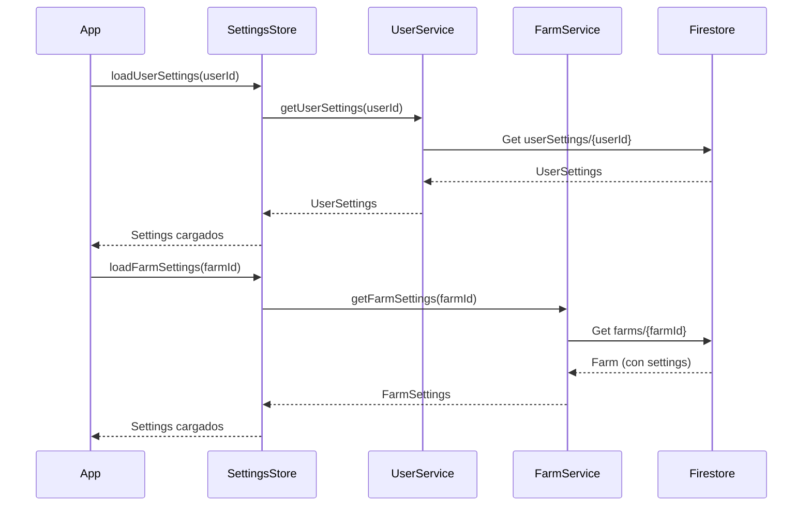
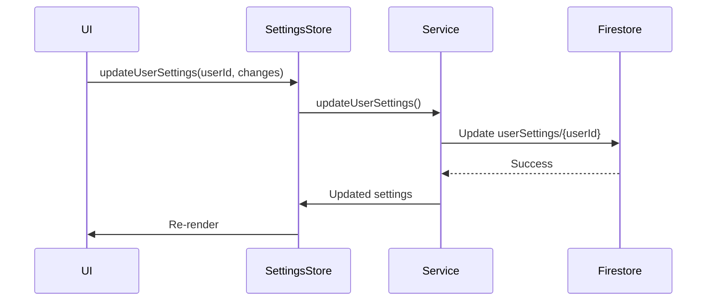

# Arquitectura de Configuraciones del SaaS Avícola

## 📋 Índice

1. [Resumen](#resumen)
2. [Niveles de Configuración](#niveles-de-configuración)
3. [Flujo de Datos](#flujo-de-datos)
4. [Uso en Código](#uso-en-código)
5. [Pantallas de Configuración](#pantallas-de-configuración)

## Resumen

El sistema de configuraciones está organizado en **3 niveles jerárquicos** para mantener una arquitectura limpia, escalable y fácil de mantener:

```
┌─────────────────────────────────────┐
│     SystemConfig (App Global)       │  🔒 Read-Only
│  Constantes, límites del sistema    │  
└─────────────────────────────────────┘
                  ↓
┌─────────────────────────────────────┐
│    UserSettings (Personal)          │  👤 Por Usuario
│  Tema, idioma, notificaciones       │  
└─────────────────────────────────────┘
                  ↓
┌─────────────────────────────────────┐
│    FarmSettings (Por Granja)        │  🏢 Por Granja
│  Precios, producción, facturación   │  
└─────────────────────────────────────┘
```

## Niveles de Configuración

### 1. SystemConfig (App Global) 🔒

**Propósito**: Configuración global del sistema, constantes, límites y features.

**Características**:
- **Read-Only** en esta app (se configura desde panel administrativo)
- Define límites del sistema por plan
- Constantes del dominio avícola
- Features habilitadas/deshabilitadas

**Ubicación**:
- Tipo: `src/types/settings.ts` → `SystemConfig`
- Servicio: `src/services/app-config.service.ts`
- Store: `src/stores/appConfigStore.ts`

**Ejemplo**:
```typescript
{
  limits: {
    maxFarmsPerAccount: 5,
    maxLotsPerFarm: 50,
    maxCollaboratorsPerFarm: 10,
  },
  constants: {
    minEggPrice: 1.0,
    maxEggPrice: 100.0,
    defaultEggsPerBox: 30,
  },
  features: {
    enabledModules: ['ponedoras', 'levantes', 'engorde'],
  }
}
```

**Cuándo usar**:
- ✅ Límites del sistema por plan
- ✅ Constantes del dominio (rangos válidos)
- ✅ Features flags
- ❌ Precios específicos (usar FarmSettings)
- ❌ Preferencias de usuario (usar UserSettings)

---

### 2. UserSettings (Personal) 👤

**Propósito**: Configuraciones personales del usuario que se aplican a todas las granjas.

**Características**:
- Independiente de la granja actual
- Se aplica globalmente para el usuario
- Persiste al cambiar de granja

**Ubicación**:
- Tipo: `src/types/settings.ts` → `UserSettings`
- Servicio: `src/services/settings/user-settings.service.ts`
- Store: `src/stores/settingsStore.ts`
- Firestore: `userSettings/{userId}`

**Estructura**:
```typescript
{
  appearance: {
    theme: 'light' | 'dark' | 'system',
    fontSize: 'small' | 'medium' | 'large',
    compactMode: boolean,
  },
  regional: {
    timezone: 'America/Santo_Domingo',
    language: 'es',
    dateFormat: 'DD/MM/YYYY',
    currency: 'DOP',
  },
  notifications: {
    enabled: true,
    channels: { push, email, sms },
    categories: { production, financial, alerts, ... },
    quietHours: { ... },
  },
  ui: {
    defaultView: 'dashboard',
    showTutorials: true,
    enableAnimations: true,
  }
}
```

**Cuándo usar**:
- ✅ Tema de la app (dark/light)
- ✅ Idioma y zona horaria del usuario
- ✅ Preferencias de notificaciones personales
- ✅ Configuración de UI (animaciones, tutoriales)
- ❌ Configuraciones de la granja (usar FarmSettings)

---

### 3. FarmSettings (Por Granja) 🏢

**Propósito**: Configuraciones específicas de cada granja (operaciones, precios, producción).

**Características**:
- Única para cada granja
- Define operaciones del negocio
- Parámetros de producción

**Ubicación**:
- Tipo: `src/types/settings.ts` → `FarmSettings`
- Servicio: `src/services/settings/farm-settings.service.ts`
- Store: `src/stores/settingsStore.ts`
- Firestore: `farms/{farmId}.settings`

**Estructura**:
```typescript
{
  pricing: {
    defaultEggPrice: 8.0,
    defaultChickenPricePerPound: 65.0,
    defaultLevantePricePerUnit: 150.0,
  },
  production: {
    israeliGrowthDays: 45,
    engordeGrowthDays: 42,
    targetEngordeWeight: 4.5,
    acceptableMortalityRate: 5.0,
    eggsPerBox: 30,
  },
  invoicing: {
    prefix: 'FAC',
    nextNumber: 1,
    format: 'FAC-{number}',
    taxRate: 0.18,
    currency: 'DOP',
  },
  notifications: {
    enabled: true,
    alerts: { highMortality, lowProduction, ... },
    thresholds: { mortalityRate: 5.0, ... },
  },
  regional: {
    timezone: 'America/Santo_Domingo',
    language: 'es',
  }
}
```

**Cuándo usar**:
- ✅ Precios específicos de la granja
- ✅ Parámetros de producción
- ✅ Configuración de facturación
- ✅ Alertas operativas de la granja
- ❌ Preferencias personales del usuario

---

## Flujo de Datos

### Carga Inicial



### Actualización



---

## Uso en Código

### Cargar Settings

```typescript
import { useSettingsStore } from '@/stores/settingsStore';
import { useAuthStore } from '@/stores/authStore';
import { useFarmStore } from '@/stores/farmStore';

function MyComponent() {
  const { user } = useAuthStore();
  const { currentFarm } = useFarmStore();
  const { userSettings, farmSettings, loadUserSettings, loadFarmSettings } = useSettingsStore();

  useEffect(() => {
    if (user) {
      loadUserSettings(user.uid);
    }
  }, [user]);

  useEffect(() => {
    if (currentFarm) {
      loadFarmSettings(currentFarm.id);
    }
  }, [currentFarm]);

  return (
    <View>
      <Text>Tema: {userSettings?.appearance.theme}</Text>
      <Text>Precio huevo: {farmSettings?.pricing.defaultEggPrice}</Text>
    </View>
  );
}
```

### Actualizar Settings

```typescript
// Actualizar User Settings
await updateUserSettings(user.uid, {
  appearance: {
    theme: 'dark',
    fontSize: 'large',
    compactMode: true,
  }
});

// Actualizar Farm Settings
await updateFarmSettings(farmId, {
  pricing: {
    defaultEggPrice: 10.0,
    defaultChickenPricePerPound: 70.0,
    defaultLevantePricePerUnit: 160.0,
  }
});
```

### Suscribirse a Cambios en Tiempo Real

```typescript
useEffect(() => {
  if (!user) return;

  const unsubscribe = subscribeToUserSettings(user.uid);
  
  return () => {
    if (unsubscribe) unsubscribe();
  };
}, [user]);
```

---

## Pantallas de Configuración

### Estructura de Pantallas

```
/(tabs)/settings/
├── index.tsx              # Pantalla principal con tabs
├── profile.tsx            # Perfil del usuario
├── appearance.tsx         # Tema y apariencia
├── notifications.tsx      # Notificaciones personales
├── regional.tsx           # Idioma, zona horaria
├── farm-info.tsx          # Info general de la granja
├── farm-pricing.tsx       # Precios de la granja
├── farm-production.tsx    # Parámetros de producción
├── farm-invoicing.tsx     # Configuración de facturación
├── farm-alerts.tsx        # Alertas de la granja
├── subscription.tsx       # Suscripción y planes
└── security.tsx           # Seguridad y contraseña
```

### Tabs de Configuración

1. **Personal**: Configuraciones del usuario
   - Perfil
   - Apariencia
   - Notificaciones
   - Regional

2. **Granja**: Configuraciones de la granja activa
   - Información General
   - Precios
   - Producción
   - Facturación
   - Alertas

3. **Cuenta**: Configuraciones de la cuenta
   - Suscripción
   - Seguridad

---

## Principios de Diseño

### Single Source of Truth (SSOT)

Cada configuración tiene un único lugar donde se define:
- **SystemConfig**: Solo en panel admin
- **UserSettings**: Solo en `userSettings/{userId}`
- **FarmSettings**: Solo en `farms/{farmId}.settings`

### Separación de Responsabilidades

- **SystemConfig**: Define QUÉ es posible
- **UserSettings**: Define CÓMO el usuario ve la app
- **FarmSettings**: Define CÓMO opera la granja

### Performance

- Cache en memoria para `UserSettings`
- Suscripción en tiempo real para actualizaciones
- Valores por defecto para inicialización rápida

### Validación

Cada servicio valida sus settings antes de guardar:
```typescript
const errors = validateFarmSettings(updates);
if (errors.length > 0) {
  throw new Error(errors.join(', '));
}
```

---

## Migración desde Arquitectura Anterior

### Antes (Problemático)

```typescript
// ❌ AppConfig tenía precios y parámetros de producción
interface AppConfig {
  precioHuevo: number;  // ← Esto es específico de la granja
  diasCrecimientoIsraeli: number;  // ← Esto también
  notificaciones: { ... };  // ← Esto es del usuario
}
```

### Ahora (Correcto)

```typescript
// ✅ SystemConfig: Solo constantes del sistema
interface SystemConfig {
  limits: { maxFarmsPerAccount: number };
  constants: { minEggPrice: number, maxEggPrice: number };
}

// ✅ UserSettings: Preferencias personales
interface UserSettings {
  appearance: { theme: 'light' | 'dark' };
  regional: { language: string };
}

// ✅ FarmSettings: Operaciones de la granja
interface FarmSettings {
  pricing: { defaultEggPrice: number };
  production: { israeliGrowthDays: number };
}
```

---

## FAQ

### ¿Dónde guardo el precio del huevo?
**R**: En `FarmSettings.pricing.defaultEggPrice` porque es específico de cada granja.

### ¿Dónde guardo el tema (dark/light)?
**R**: En `UserSettings.appearance.theme` porque es preferencia personal del usuario.

### ¿Dónde guardo límites por plan?
**R**: En `SystemConfig.limits` porque es configuración global del sistema.

### ¿Qué pasa si cambio de granja?
**R**: `UserSettings` persiste (tema, idioma, etc.), solo se cargan los nuevos `FarmSettings`.

### ¿Cómo manejo notificaciones?
**R**: 
- **Preferencias personales** (canales, horarios): `UserSettings.notifications`
- **Alertas de la granja** (umbrales, tipos): `FarmSettings.notifications`

---

## Conclusión

Esta arquitectura de 3 niveles proporciona:

✅ **Claridad**: Cada setting tiene su lugar correcto  
✅ **Escalabilidad**: Fácil agregar nuevas configuraciones  
✅ **Mantenibilidad**: Código organizado y predecible  
✅ **Performance**: Cache y suscripciones optimizadas  
✅ **UX**: Settings organizados en tabs intuitivos  

Para agregar una nueva configuración, pregúntate:
1. ¿Es del sistema, del usuario o de la granja?
2. ¿Persiste al cambiar de granja?
3. ¿La configura el usuario o el admin del sistema?

Y colócala en el nivel correspondiente.


